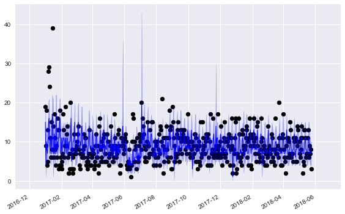
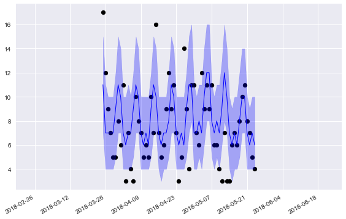
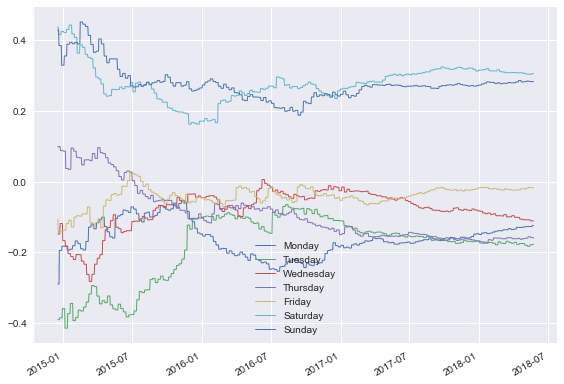
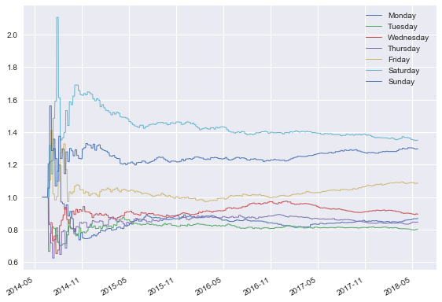

Sales Forecasting: In-Depth Example
===================================

In this example we will model a simulated dataset of daily item sales.
Because the sales are integer valued, we’ll use a Poisson DGLM:

.. math:: y_t \sim Pois(\mu_t)

.. math:: \log(\mu_t) = \lambda_t = F_t^{'} \theta_t

Where :math:`\theta_t` is the state vector, :math:`\mu_t` is the Poisson
mean, and :math:`\lambda_t` is called the linear predictor.

We’re going to define a dynamic model with the following components in
the state vector:

-  **Trend:** 1 intercept term
-  **Regression:** 2 regression terms for Price and a 0-1 indicator for
   any sales or promotions.
-  **Holidays:** We use 10 standard holidays. These are actually just
   more regression terms, with a 0-1 indicator for each holiday.
-  **Seasonality:** A seasonal component with period 7 for the
   day-of-the-week. The seasonality is defined in terms of harmonic
   components - we’ll use the first 3, which means there are 6
   coefficients. We will demonstrate how to translate the coefficients
   into 7 interpretable values, one for each day of the week.

.. code::

    import numpy as np
    import pandas as pd
    import matplotlib.pyplot as plt
    from pandas.tseries.holiday import USFederalHolidayCalendar
    from pybats.analysis import analysis
    from pybats.point_forecast import median
    from pybats.plot import plot_data_forecast, ax_style, plot_coef
    from pybats.shared import load_sales_example2

Load in the data
~~~~~~~~~~~~~~~~

.. code::

    data = load_sales_example2()
    data = data.set_index('Date')
    data.head()

.. raw:: html

    

    
    <table border="1" class="dataframe">
      <thead>
        <tr style="text-align: right;">
          <th></th>
          <th>Sales</th>
          <th>Price</th>
          <th>Promotion</th>
        </tr>
        <tr>
          <th>Date</th>
          <th></th>
          <th></th>
          <th></th>
        </tr>
      </thead>
      <tbody>
        <tr>
          <td>2014-06-01</td>
          <td>15.0</td>
          <td>1.11</td>
          <td>0.0</td>
        </tr>
        <tr>
          <td>2014-06-02</td>
          <td>13.0</td>
          <td>2.19</td>
          <td>0.0</td>
        </tr>
        <tr>
          <td>2014-06-03</td>
          <td>6.0</td>
          <td>0.23</td>
          <td>0.0</td>
        </tr>
        <tr>
          <td>2014-06-04</td>
          <td>2.0</td>
          <td>-0.05</td>
          <td>1.0</td>
        </tr>
        <tr>
          <td>2014-06-05</td>
          <td>6.0</td>
          <td>-0.14</td>
          <td>0.0</td>
        </tr>
      </tbody>
    </table>
    

The simulated dataset contains daily sales of an item from June 1, 2014
to June 1, 2018.

-  The Price column represents percent change in price from the moving
   average, so it’s centered at 0.
-  Promotion is a 0-1 indicator for a specific sale or promotion on the
   item.

Run the analysis
~~~~~~~~~~~~~~~~

The PyBATS analysis function provides an easy wrapper that will:

-  Define a model prior
-  Sequentially update the model (forward filter) and forecast k steps
   ahead
-  Return the final model, forecast samples, and potentially the stored
   model coefficients

We know what terms we want in our model, and we’ll need to define them
using the analysis function. When we pass in the covariates (Price and
Promotion) and list of holidays, those terms are automatically added to
the model. We will manually say that we want a seasonal component with a
period of 7. An intercept (1 trend term) is the default, so we don’t
need to pass in any arguments for that.

We also have to set a few parameters that specify what dates we want to
forecast, what forecast horizon we’re considering, and how many data
points to use for setting a prior.

.. code::

    prior_length = 21   # Number of days of data used to set prior
    k = 7               # Forecast horizon
    rho = 0.5           # Random effect discount factor to increase variance of forecast distribution
    forecast_samps = 2000  # Number of forecast samples to draw
    forecast_start = pd.to_datetime('2017-01-01') # Date to start forecasting
    forecast_end = pd.to_datetime('2018-05-24')   # Date to stop forecasting

.. code::

    mod, samples, model_coef = analysis(data.Sales.values, data[['Price', 'Promotion']].values,
                            k, forecast_start, forecast_end, nsamps=forecast_samps,
                            family='poisson',
                            seasPeriods=[7], seasHarmComponents=[[1,2,3]],
                            prior_length=prior_length, dates=data.index, holidays=USFederalHolidayCalendar.rules,
                            rho=rho,
                            ret = ['model', 'forecast', 'model_coef'])

.. parsed-literal::

    beginning forecasting

We specified the desired output with the argument ‘ret’, for return. The
outputs are:

-  **Model**: The model is of class *dglm*, and has been sequentially
   updated through to the date *forecast_end*.
-  **Forecast Samples:** Each day in the range *forecast_start* to
   *forecast_end*, the model forecasts *k* steps ahead, drawing samples
   from the forecast distribution. The output samples have shape
   (*forecast_samps* \* *forecast_length* \* *k*).
-  **Model Coefficients:** Not part of the default output from the
   analysis function, but we’re interested how the day-of-week effect
   changes over time, so we’ve saved the complete history of the state
   vector. This contains the posterior means and variances.

Plot the forecast results
~~~~~~~~~~~~~~~~~~~~~~~~~

Let’s start by looking at the 1-step ahead forecasts over the full
forecasting period:

.. code::

    data_1step = data.loc[forecast_start:forecast_end]
    samples_1step = samples[:,:,0]
    fig, ax = plt.subplots(1,1)
    ax = plot_data_forecast(fig, ax,
                            data_1step.Sales,
                            median(samples_1step),
                            samples_1step,
                            data_1step.index,
                            credible_interval=75)

.. code::

    plt.show(fig)

We’re plotting the median forecasts along with the :math:`75\%` credible
intervals. One very clear pattern is the weekly effect, with a weekly
spike in our forecasts. There’s also a very noticable holiday effect -
sales are unpredictable on holidays, and our credible intervals become
very large.

You’re probably wondering: How accurate are those point forecasts?

.. code::

    from pybats.loss_functions import MAD, ZAPE
    print(MAD(data_1step.Sales, median(samples_1step)))
    print(ZAPE(data_1step.Sales, median(samples_1step)))

.. parsed-literal::

    2.72003929273
    49.3051456543

The first loss function is the Mean Absolute Deviation (MAD). Note that
we’re using the median for our point forecast - the median is the
optimal forecast for minimizing the MAD, just as the mean is optimal for
minimizing the Mean Square Error (MSE).

The second number is the Zero-Adjusted Absolute Percent Error (ZAPE).
This is equivalent to the Mean Absolute Percent Error (MAPE), but is
still defined even when the sales are 0. On days when sales are 0, then
the ZAPE loss is equal to the forecast. Interpreting this as a percent
error metric, we’re off by a significant margin - but not bad for noisy
sales data either! The median is not the optimal forecast to minimize
ZAPE, but it’s a simple and easy point forecast to obtain.

Okay, now let’s zoom in to just the final 60 days of forecasting, to a
more detailed picture of our online, sequential forecasts:

.. code::

    data_1step = data.loc[forecast_end-pd.DateOffset(60):forecast_end]
    samples_1step = samples[:,-61:,0]
    fig, ax = plt.subplots(1,1)
    ax = plot_data_forecast(fig, ax,
                            data_1step.Sales,
                            median(samples_1step),
                            samples_1step,
                            data_1step.index,
                            credible_interval=75)

.. code::

    plt.show(fig)

These forecasts look pretty good! Our :math:`75\%` credible intervals
capture the true sales most of the time, as it should. The weekly
pattern is much more clearly visible here.

What if we want to monitor the day-of-week effects? It looks like
they’re changing over time - what days are becoming more or less
popular? Well, that’s why we saved the model coefficients, so we can
answer exactly that question!

Plotting the day-of-week seasonality
~~~~~~~~~~~~~~~~~~~~~~~~~~~~~~~~~~~~

We start by taking the posterior coefficents and only looking at the 6
seasonal coefficients, using the ‘mod.iseas’ property to get the indices
for the seasonal components.

Then, we transform these harmonic seasonal components into interpretable
coefficients for the 7 days of the week. For more details on this
process, look at *Bayesian Forecasting and Dynamic Models* by Harrison
and West, Chapter 8.

.. code::

    harm_post_mean = model_coef['m'][:,mod.iseas[0]]
    dow_post_mean = mod.L[0] @ harm_post_mean.T

Next, we’ll align these 7 components with the days of the week, and plot
the posterior mean of the coefficients over time. Unfortunately, the
structure of the seasonal components means that even after the
transformation, the days are rotated. The ‘current’ day will always
appear first in each row in the matrix, so we’re going to pluck only
that day.

.. code::

    def order_dow(seas_eff, date):
        day = date.dayofweek
        out = np.zeros(7)
        out[day] = seas_eff[0]
        return(out)

.. code::

    dow_post_mean_plot = pd.DataFrame([order_dow(seas_eff, date) for seas_eff, date in zip(dow_post_mean.T, data.loc[:forecast_end].index)])
    dow_post_mean_plot = dow_post_mean_plot.replace(to_replace=0, method='ffill')

.. code::

    days = ['Monday', 'Tuesday', 'Wednesday', 'Thursday', 'Friday', 'Saturday', 'Sunday']

.. code::

    start_day = 200    # Only starting to plot after model has learned the day-of-week effect
    fig, ax = plt.subplots(1,1)
    ax = plot_coef(fig, ax, dow_post_mean_plot.iloc[start_day:], dates=data.iloc[start_day:].loc[:forecast_end].index, legend=days)

.. code::

    plt.show(fig)

Okay, now this is interesting! We have a few clear takeaways:

-  Saturday and Sunday have the highest sales
-  Monday through Thursday all have very similar sales, with
   coefficients between -0.1 to -0.2.

These effects in the state space are additive on the log scale. Remember
the Poisson DGLM has a log-link function:

.. math:: \log(\mu_t) = \lambda_t

.. math:: \lambda_t = F_t^{'} \theta_t

If we want to interpret these effects in terms of actual sales, we need
to recognize that they are additive and on the log scale in the state
space. In terms of the prior mean, the effect is multiplicative. First,
we can decompose the linear predictor into seasonal and other terms:

.. math:: F_t^{'} \theta_t = F_{seas, t}^{'} \theta_{seas, t} + F_{other, t}^{'} \theta_{other, t}

Then think in terms of the conjugate prior:

.. math:: \mu_t = e^{F_{seas, t}^{'} \theta_{seas, t}} * e^{F_{other, t}^{'} \theta_{other, t}}

The regression vector F_seas is just a 0-1 indicator to pluck out the
correct day’s seasonal effect. So to interpret each day’s
*multiplicative* effect on sales, we take the exponent of the graph
above:

.. code::

    fig, ax = plt.subplots(1,1)
    ax = plot_coef(fig, ax, np.exp(dow_post_mean_plot)[start_day:], dates=data.iloc[start_day:].loc[:forecast_end].index, legend=days)

.. code::

    plt.show(fig)

Perfect, this is very clear! A multiplicative seasonal effect of 1 has
no effect on Sales. Anything larger than 1 boosts sales, and smaller
than 1 reduces them. Looking at the end of the time period, we can say:

-  Saturday and Sunday have around 30-40% higher sales than the average
   day.
-  Monday-Thursday all have between 10-20% lower sales than the average
   day.
-  Friday lands in the middle, with approximately average sales.

The long term trends look fairly stable, which is natural - shopping
habits change slowly over time. Part of that also comes from our model
definition. The discount factor on the seasonality component is very
close to 1, so we discount historical information slowly. If we believed
that these day-of-week effects changed more rapidly over time, we could
re-run the analysis with a lower discount factor, using the parameter
*delseas* as an argument to the analysis function.

Conclusions
~~~~~~~~~~~

In this example we’ve used the PyBATS package to complete an analysis of
simulated sales data. We:

-  Used the ‘analysis’ function to define a Poisson DGLM with the first
   21 days of data. It then performed online model updating and
   forecasting, 1-7 days ahead.
-  Analyzed the 1-day ahead forecasts, and calculated two error metrics
   on our point forecasts.
-  Plotted the forecasts, saw the added uncertainty caused by holidays,
   and the very strong day-of-week effects.
-  Deep-dived into those day-of-week effects, plotting their evolution
   over time

There’s plenty more that we could have explored here as well:

-  Forecasts with a longer horizon. How accurate are our 7-day ahead
   forecasts, and are they also well calibrated?
-  Other state vector components, such as the trend, regression, and
   holiday terms. They are all saved in the *model_coef* output. To
   interpret them, we need to transform from the log scale into the
   space of the conjugate prior, just as we did with the seasonal
   effects.
-  Forecast *totals* over the next week or month. This type of
   forecasting requires drawing joint samples over 1:k days into the
   future, and then taking a sum over each sample from the forecast
   distribution. This is known as *path forecasting*, and can be
   accomplished with the method *mod.path_forecast*.
